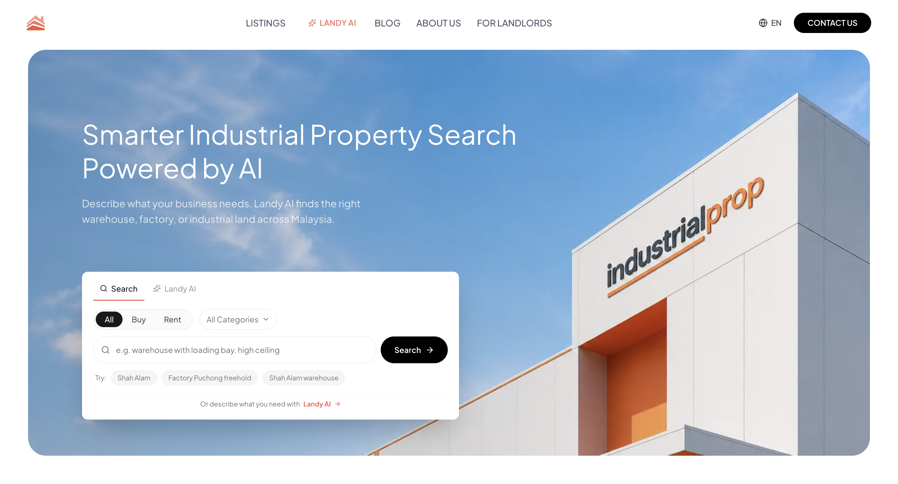
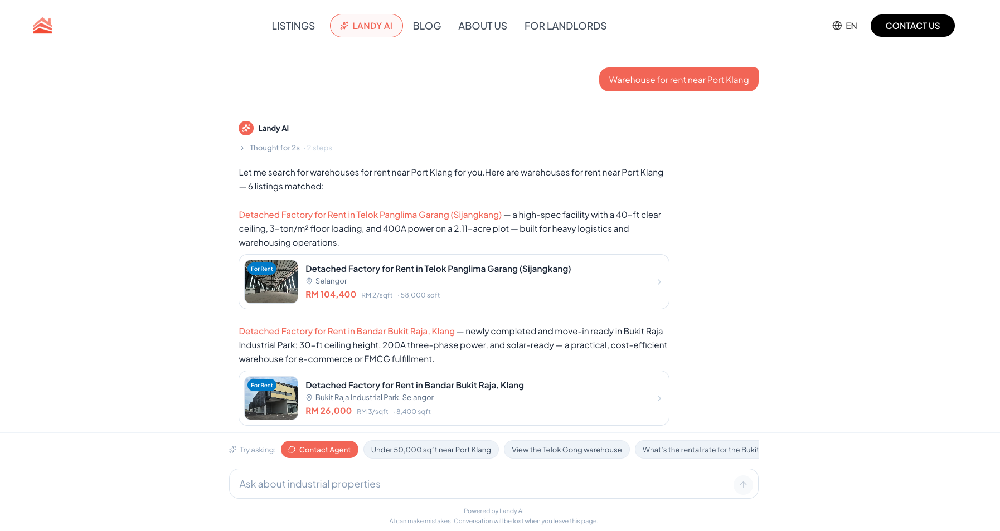
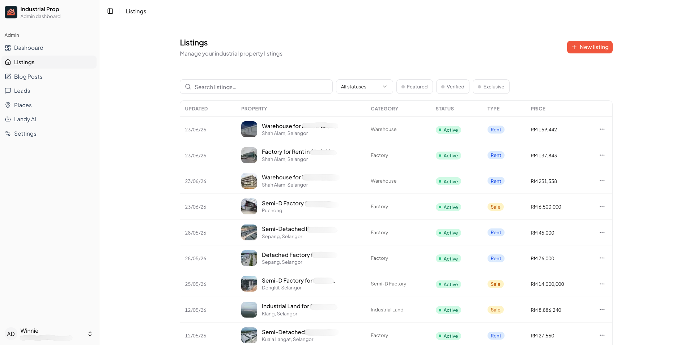

<div align="center">
  
  <p>
    AI-powered platform for discovering industrial property across Malaysia's Klang Valley.</br>
    Warehouses, factories, industrial land: search with filters or natural language, then connect with agents in one place.
  </p>
</div>



<div align="center">
  <p>
    🤖 Landy AI: conversational search with live listings and lead capture</br>
    🌐 Multilingual (EN · BM · 简中 · 繁中) · SEO-first · server-rendered</br>
    🔗 https://www.industrialprop.com.my/
  </p>
</div>

---

<details>
<summary>Table of Contents</summary>

- [Features](#features)
- [Tech Stack](#tech-stack)
- [Architecture](#architecture)

</details>

## Features

### User site

<div align="center">
  &nbsp;&nbsp;&nbsp;&nbsp;&nbsp;&nbsp;
</div>

- **Search & browse**: filter by category, offer type (sale/rent), location, price and size; semantic free-text query; sorting and pagination.
- **Listing detail**: full specs, image gallery, interactive map (MapLibre GL) and agent contact.
- **Landy AI assistant** (`/landy-ai`): natural-language property search with streamed responses, live result cards, and one-click handoff to a human agent.
- **Blog**: articles with rich content rendering.
- **Content pages**: About, Contact, Buyers Guide, List Your Property, plus legal pages.
- **Lead capture**: contact and enquiry forms across the site.

### Admin dashboard (`/admin`)

<div align="center">
  
</div>

- **Auth**: cookie-based token login, protected routes.
- **Overview**: listing / blog / lead counts and recent activity.
- **Listings**: full CRUD with a multi-step form, image upload + drag-to-reorder, and a detail sheet.
- **Blog posts**: CRUD with a BlockNote rich-text editor and a live preview route.
- **Leads**: table of incoming enquiries.
- **Conversations**: logs of Landy AI chat sessions.
- **Settings**: admin profile management.

</br>
</br>

## Tech Stack

| Area        | Choice                                                        |
| ----------- | ------------------------------------------------------------- |
| Framework   | Next.js 16 (App Router), React 19, TypeScript                 |
| Styling     | Tailwind CSS v4, shadcn/ui (Radix primitives), `lucide-react` |
| Data        | TanStack Query, TanStack Table                                |
| Forms       | React Hook Form + Zod                                         |
| i18n        | next-intl (4 locales)                                         |
| Editor      | BlockNote                                                     |
| Maps        | MapLibre GL                                                   |
| Animation   | Framer Motion                                                 |
| Interaction | dnd-kit (drag & drop), Sonner (toasts)                        |
| Tooling     | ESLint, Prettier, pnpm                                        |

## Architecture

```
Browser ──▶ Next.js route handlers (/api/*)  ──▶  Upstream API backend
            · attach auth token from cookie
            · same-origin proxy (no CORS)
            · stream AI chat responses
```

- Server Components fetch directly from the upstream API with the request's auth cookie.
- Client Components call the local `/api/*` proxy, which injects the token and forwards the request.
- Admin auth uses an `admin_token` cookie; 401s clear the session and redirect to login.

> This repo is the frontend + BFF layer; the API backend lives in a separate service.

---

Built with Next.js 16, React 19, and TypeScript
